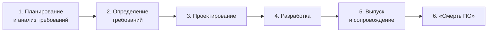
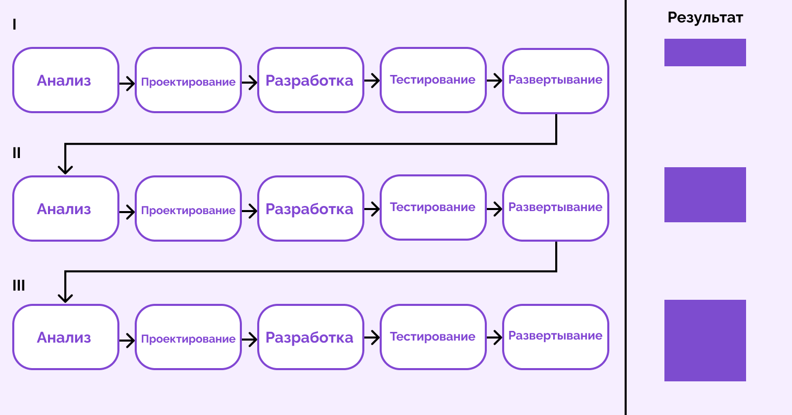
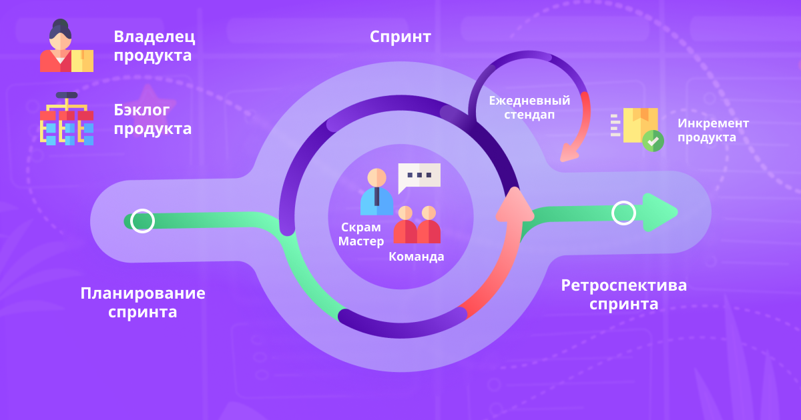
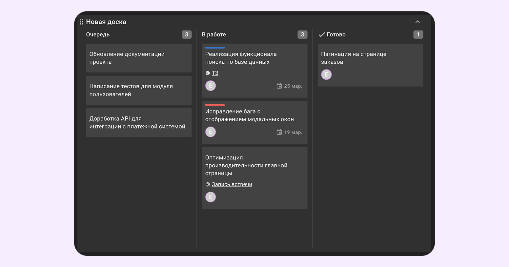
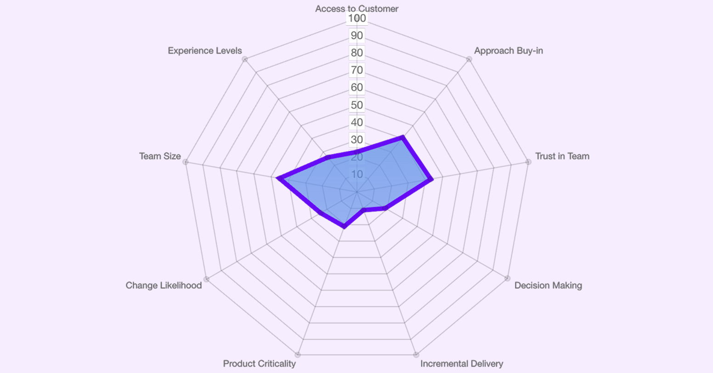

# Лекция 1. Жизненный цикл разработки ПО (SDLC)

> **Жизненный цикл** — это путь, который проходит продукт: от момента задумки до вывода из эксплуатации.

**SDLC** (Software Development Life Cycle) — последовательный процесс разработки программного обеспечения, охватывающий планирование, проектирование, реализацию, тестирование, развёртывание и сопровождение. SDLC нужен, чтобы распределять ресурсы, планировать работы и избегать хаоса в процессах разработки.

---

## Содержание

1. [Этапы жизненного цикла ПО](#этапы-жизненного-цикла-по)
2. [Верхнеуровневое и низкоуровневое проектирование](#верхнеуровневое-и-низкоуровневое-проектирование)
3. [Модели жизненного цикла разработки ПО](#модели-жизненного-цикла-разработки-по)
   - [Каскадная (водопадная)](#1-каскадная-водопадная-модель)
   - [V-образная](#2-v-образная-модель)
   - [Итеративная](#3-итеративная-модель)
   - [Инкрементная](#4-инкрементная-модель)
   - [Спиральная](#5-спиральная-модель)
   - [Agile](#6-agile)
   - [Scrum](#7-scrum)
   - [Kanban](#8-kanban)
4. [Как выбрать модель](#как-выбрать-модель)

---

## Этапы жизненного цикла ПО

### 1. Планирование и анализ требований

На этом этапе команда собирает исходные данные и понимает, что именно нужно построить.

- Описание задач, которые должен решать продукт
- Опрос стейкхолдеров
- Выявление аудитории, которая будет пользоваться решением
- Оценка ресурсов, которые нужны для реализации: количество сотрудников, бюджет
- Согласование критериев, по которым будут оценивать успешность решения

### 2. Определение требований

Уточнение целей, оценка рисков, подготовка документации.

- Оценка рисков
- Выбор методологии работы
- Описание пользовательских сценариев

### 3. Проектирование

Разработка архитектуры системы. Проектирование делится на два уровня — верхнеуровневое и низкоуровневое (см. следующий раздел).

### 4. Разработка

Написание кода, интеграция компонентов, первичное модульное тестирование.

### 5. Выпуск и сопровождение

Выпуск продукта в промышленную эксплуатацию, обновления, исправление ошибок, техническая поддержка пользователей.

### 6. «Смерть ПО»

Вывод из эксплуатации: архивирование данных, прекращение поддержки, миграция пользователей на новые решения.

---

## Верхнеуровневое и низкоуровневое проектирование

Проектирование системы разделено на два уровня, различающихся глубиной детализации.

| Верхнеуровневое проектирование | Низкоуровневое проектирование |
| --- | --- |
| Основные компоненты системы — модули, сервисы, подсистемы | Принцип работы отдельных компонентов системы |
| Принцип взаимодействия компонентов между собой | Алгоритмы, структуры данных и логика работы внутри каждого модуля |
| Общая архитектура системы — клиент-серверная, микросервисы | Детали реализации — какие классы, методы, функции будут созданы |
| Зависимость решения от других систем | Взаимодействие с базами данных, API и внешними системами |
| Прототип решения | — |

---

## Модели жизненного цикла разработки ПО

### 1. Каскадная (водопадная) модель

Последовательный процесс: каждый следующий этап начинается только после завершения предыдущего. Движение возможно только вперёд.

**Плюсы**
- Полная документация
- Низкий риск ошибок при чётких требованиях
- Прозрачность для заказчика

**Минусы**
- Отсутствие гибкости
- Сложность учесть все требования заранее
- Заказчик видит результат только в конце

**Когда применять:** требования зафиксированы и не изменяются, работа ведётся по строгим регламентам.

---

### 2. V-образная модель

Расширение каскадной модели: каждому этапу разработки соответствует свой этап тестирования. Левая сторона «галочки» — **верификация**, правая — **валидация**.

**Плюсы**
- Раннее выявление ошибок
- Высокая надёжность
- Хороший анализ рисков

**Минусы**
- Отсутствие гибкости
- Высокие затраты

**Когда применять:** чёткие требования, строгие регламенты, необходимо большое тестовое покрытие.

---

### 3. Итеративная модель

Проект дробится на итерации. В каждой итерации продукт проходит все этапы SDLC и «дорисовывается» от общего наброска до готового продукта. Требования могут уточняться по обратной связи.

**Ключевая идея:** от итерации к итерации результат уточняется — эскиз → черновой прототип → готовый продукт (см. колонку «Результат» на схеме).

**Плюсы**
- Быстрый выход на рынок (MVP)
- Видимость промежуточных результатов
- Гибкость в требованиях

**Минусы**
- Сложности с проработкой архитектуры системы наперёд

**Когда применять:** нечёткие требования, нужно быстрое решение, крупный проект с ограниченными ресурсами.

---

### 4. Инкрементная модель

Продукт создаётся по частям — инкрементам. Каждый инкремент — законченный, готовый к использованию функционал.

**Отличие от итеративной:** каждый инкремент добавляет **новую функциональность**, а не уточняет существующую (сравните колонки «Результат» на схемах моделей 3 и 4).

**Плюсы**
- Пользователи начинают работать с продуктом рано
- Видимость прогресса

**Минусы**
- Риск проблем при интеграции параллельно разрабатываемых инкрементов
- Требует тщательного планирования

**Когда применять:** нужно быстрое решение, нечёткие требования, крупный проект.

---

### 5. Спиральная модель

Объединяет каскадную и итеративную модели с акцентом на **анализ рисков**. Разработка идёт витками спирали; каждый виток проходит четыре квадранта.

С каждым витком детализация и объём продукта нарастают: v1 → v2 → v3 → v4.

**Плюсы**
- Выявление рисков на ранних этапах
- Возможность вносить изменения
- Подходит для крупных, критичных систем

**Минусы**
- Многочисленные циклы затягивают разработку и удорожают её

**Когда применять:** неопределённые требования, высокие требования к надёжности, использование новых технологий.

---

### 6. Agile

**Agile** — не отдельная модель, а набор принципов гибкого управления проектами. Ключевые ценности из Agile-манифеста:

> - Люди и взаимодействие важнее процессов и инструментов
> - Работающий продукт важнее исчерпывающей документации
> - Сотрудничество с заказчиком важнее согласования условий контракта
> - Готовность к изменениям важнее следования плану

На основе Agile построены практические фреймворки — **Scrum** и **Kanban**.

---

### 7. Scrum

Гибкий фреймворк на основе коротких итераций — **спринтов** длительностью 2–4 недели.

**Роли**

| Роль | Задача |
| --- | --- |
| Владелец продукта | Формирует и приоритизирует бэклог |
| Скрам-мастер | Помогает команде следовать процессу |
| Команда разработки | Реализует инкремент за спринт |

**Плюсы**
- Быстрая реакция на изменения
- Видимый прогресс каждые 2–4 недели
- Регулярная обратная связь

**Минусы**
- Сильно зависит от вовлечённости заказчика и команды

**Когда применять:** нечёткие требования, активный заказчик, самоорганизующаяся команда.

---

### 8. Kanban

Метод визуализации потока работ, направленный на постоянное улучшение процессов. Использует канбан-доски, ограничения WIP (work in progress) и метрики потока.

**Плюсы**
- Легко внедрить
- Высокая адаптивность
- Прозрачность процессов
- Помогает избежать многозадачности

**Минусы**
- Сложность организации в командах от 10 человек

**Когда применять:** командам, делающим упор на прогнозирование сроков поставки.

---

## Как выбрать модель

Компании не обязаны строго следовать одной модели — на практике часто **сочетают подходы**. Для осознанного выбора применяют инструмент **Agile Suitability Filter**, оценивающий проект по осям:

- **Команда** — размер, опыт
- **Культура** — поддержка подхода, доверие в команде, принятие решений
- **Проект** — критичность продукта, вероятность изменений
- **Поставка** — инкрементальность, доступ к заказчику

### Сравнение моделей

| Модель | Гибкость | Документация | Управление рисками | Когда выбирать |
| --- | :---: | :---: | :---: | --- |
| Каскадная | низкая | максимальная | риски поздние | стабильные требования |
| V-образная | низкая | максимальная | риски ранние | строгие регламенты, высокая надёжность |
| Итеративная | средняя | средняя | средние | нечёткие требования, MVP |
| Инкрементная | средняя | средняя | средние | быстрая поставка кусками |
| Спиральная | высокая | высокая | управляемые | крупные, критичные системы |
| Scrum | высокая | низкая | риски ранние | активный заказчик |
| Kanban | высокая | низкая | управляемые | потоковая работа, поддержка |

---

## Источник

Материал (текст и иллюстрации в папке `images/`) подготовлен на основе статьи: [Обзор SDLC — Habr / Kaiten](https://habr.com/ru/companies/kaiten/articles/893866/)
