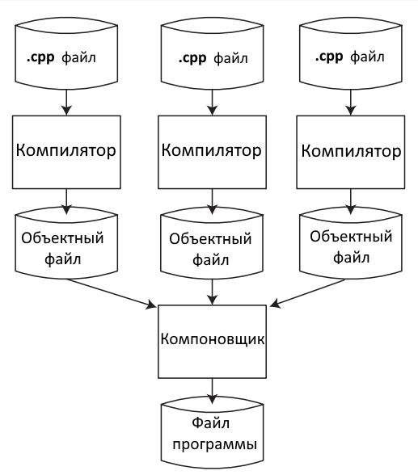

# Лекция 2. Введение в C++

> **Язык программирования C++** — это высокоуровневый компилируемый язык программирования общего назначения со статической типизацией.  
> Своими корнями он уходит в язык C, который был разработан в 1969–1973 годах в компании Bell Labs программистом **Деннисом Ритчи**.

---

## История создания

В начале 1980-х годов датский программист **Бьёрн Страуструп**, работая в Bell Labs, создал C++ как расширение языка C. Изначально C++ просто дополнял C некоторыми возможностями объектно-ориентированного программирования (ООП).

---

## Компилируемый язык

C++ является **компилируемым языком**. Это означает, что компилятор транслирует исходный код на C++ в исполняемый файл, содержащий набор машинных инструкций, понятных процессору.

---

## Основные компиляторы

| Компилятор       | Разработчик          | Примечание                     |
|------------------|----------------------|--------------------------------|
| **g++**          | GNU Project          | Стандарт де-факто в Linux/Unix |
| **Clang**        | LLVM Foundation      | Быстрая компиляция, отличные диагностики |
| **MSVC**         | Microsoft            | Входит в состав Visual Studio  |

---

## Состав компилятора g++

Процесс компиляции с помощью `g++` включает несколько отдельных инструментов:

1. **cpp** – препроцессор.
2. **as** – ассемблер.
3. **g++** – собственно компилятор.
4. **ld** – линкер.

---

## Зачем нужна компиляция?

Исходный C++-файл — это всего лишь текст. Его нельзя запустить как программу или использовать как библиотеку. Поэтому каждый исходный файл необходимо скомпилировать в исполняемый файл, который уже может быть выполнен операционной системой.

---

## Этапы компиляции

1. **Препроцессинг**  
 - это макро процессор, который преобразовывает вашу программу для дальнейшего компилирования. На данной стадии происходит происходит работа с препроцессорными директивами.
Например, препроцессор добавляет хэдеры в код (`#include`), убирает комментирования.
2. **Компиляция**
   - на данном шаге g++ выполняет свою главную задачу — компилирует, то есть преобразует полученный на прошлом шаге код без директив в ассемблерный код. Это промежуточный шаг между высокоуровневым языком и машинным (бинарным) кодом.
3. **Ассемблирование**
   - перевод ассемблировного кода в машинный.
   - объектный файл - это созданный ассемблиром промежуточный файлом, который хранит в себе кусок машинного кода. Этот кусок машинного кода, который еще не был связан вместе с другими кусками машинного кода - назыывается объектным кодом.
4. **Компновка**
   - компановщик (limker), связывает все объектые файлы и статические библиотеки в единный исполняемый файл
5. ""Загрузка""

---

## Задание

> Опишите структуру проекта C++ VS, объясните каждый файл.

---

| Элемент в обозревателе решений | Что это такое (аналогия) | Зачем нужен |
| --- | --- | --- |
| **Решение (ConsoleApplication1)** | Генеральный план застройки участка | Объединяет один или несколько проектов, хранит общие настройки сборки (Debug/Release) |
| **Проект (ConsoleApplication1)** | Сам дом, который мы строим | Единица сборки: из него получается .exe-файл. Содержит все файлы и настройки для одной программы |
| **Ссылки (References)** | Договоры с поставщиками материалов | В чистом C++ почти не используется; нужен для подключения .NET-компонентов (C++/CLI) |
| **Внешние зависимости (External Dependencies)** | Список чертежей и стандартов, которые мы используем (ГОСТы, СНиПы) | Показывает заголовочные файлы из стандартной библиотеки и сторонних SDK, подключённые через `#include` (например, `<iostream>`) |
| **Исходные файлы (Source Files)** | Рабочие чертежи с полной детализацией и сами кирпичи | Файлы `.cpp` с реализацией кода. Здесь живёт функция `main()` и логика программы |
| **Файлы заголовков (Header Files)** | Архитектурные эскизы и спецификации (что есть в доме, но без деталей реализации) | Файлы `.h`/`.hpp` с объявлениями классов, структур, прототипами функций. Позволяют разделять интерфейс и реализацию |
| **Файлы ресурсов (Resource Files)** | Мебель, декор, вывески | Не-кодовые ресурсы: иконки, строки, диалоги, манифесты. В простых консольных приложениях обычно пусто |

## Пример проекта

- `ConsoleApplication1.cpp` (в папке **Исходные файлы**) — это «сердце» программы. Здесь начинается выполнение кода с функции `main()`.
- **Внешние зависимости** покажут, какие стандартные библиотеки вы используете (например, если в коде есть `#include <iostream>`, Visual Studio отобразит `iostream` в этом списке).

